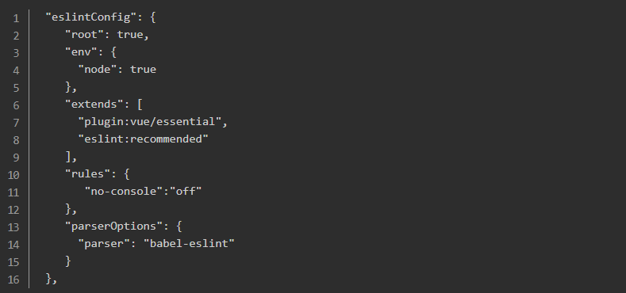

# Vue3.0报错error: Unexpected console statement (no-console) 解决办法
### 写项目过程中用ESLint遵守代码规范很有必要，但是对于一些规范也很是无语，比如：‘Unexpected console statement (no-console)’，连console都不能用，这就很抓狂了。其实增加一行代码即可。

### 修改package.json中的eslintConfig:{} 中的 “rules”:{}，增加一行代码: "no-console":"off"

#### 示例：

