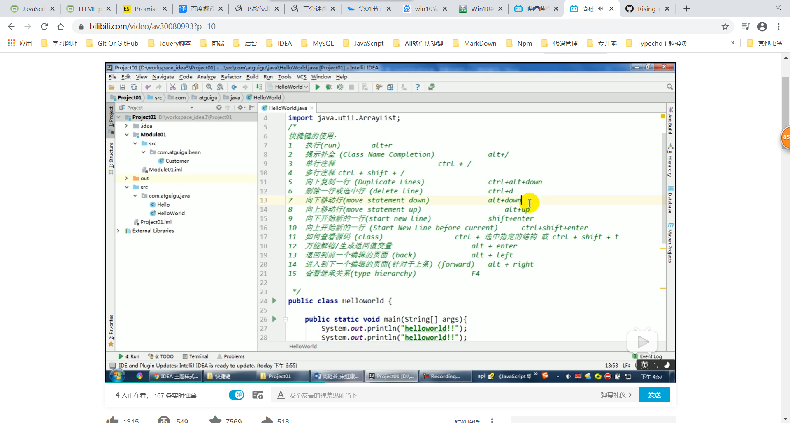
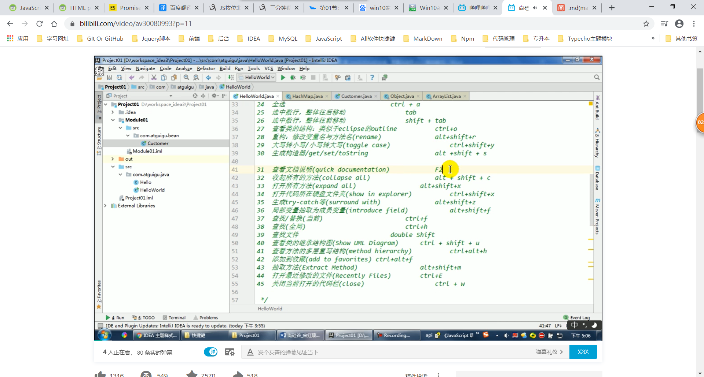

# idea
### idea介绍
>IDEA 全称 IntelliJ IDEA，是java编程语言开发的集成环境。IntelliJ在业界被公认为最好的java开发工具，尤其在智能代码助手、代码自动提示、重构、J2EE支持、各类版本工具(git、svn等)、JUnit、CVS整合、代码分析、 创新的GUI设计等方面的功能可以说是超常的。IDEA是JetBrains公司的产品，这家公司总部位于捷克共和国的首都布拉格，开发人员以严谨著称的东欧程序员为主。它的旗舰版本还支持HTML，CSS，PHP，MySQL，Python等。免费版只支持Python等少数语言

### idea的主要优势
相对于eclipes而言
1. 强大的总和能力，比如git、maven、spring
2. 提示功能的快速、便携
3. 提示功能的范围广
4. 好用的快捷键和代码模块
5. 精准搜索

### idea快捷键



### idea快捷模板
>Idea中代码模板所处位置:settings - Editor - live Templates或者Postfix  Completion
```js
    // 常用模板
        // 模板 psvm 
            public static void main(String[] args) {}
        //输出 sout
            System.out.println();
        // 变形 soutp/soutm/soutv/xxx.sout  
            System.out.println("arge=["+args+"]");
        //循环遍历 fori
            for (int i = 0; i < ; i++) {}
        // 变形iter
            for (int i : result) {}
        //变形itar
            for (int i = 0; i < result.length; i++) {int i1 = result[i];}
```
### idea集合快捷遍历
```js
    增强：list.for
    变形：list.fori //正序遍历
    变形：list.forr //倒叙遍历
```
### ideaif模板
```js
    ifn生成if(xxx=null)
    inn生成if(xxx!=null)
    xxx.nn或xxx.null
```
### prsf
```js
    // prsf
        private static final 
    //psfi
        public static final int 
    //psfs
        public static final String 
```
