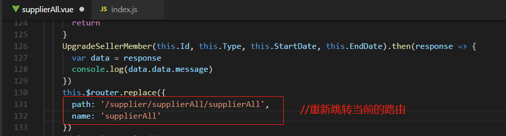
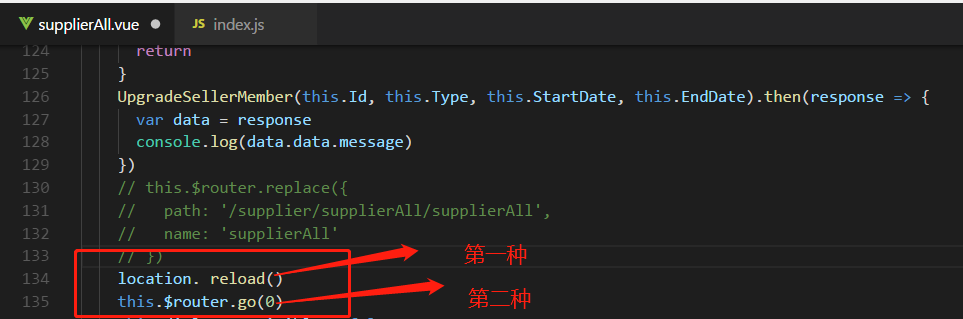
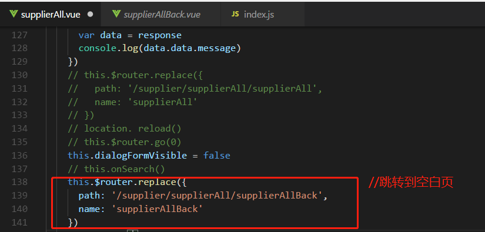
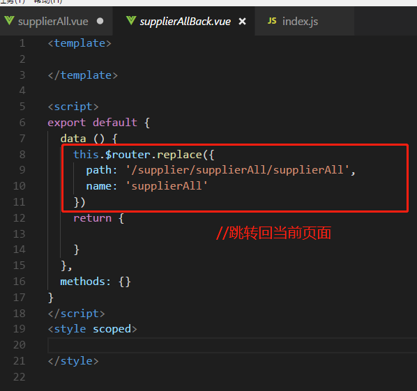
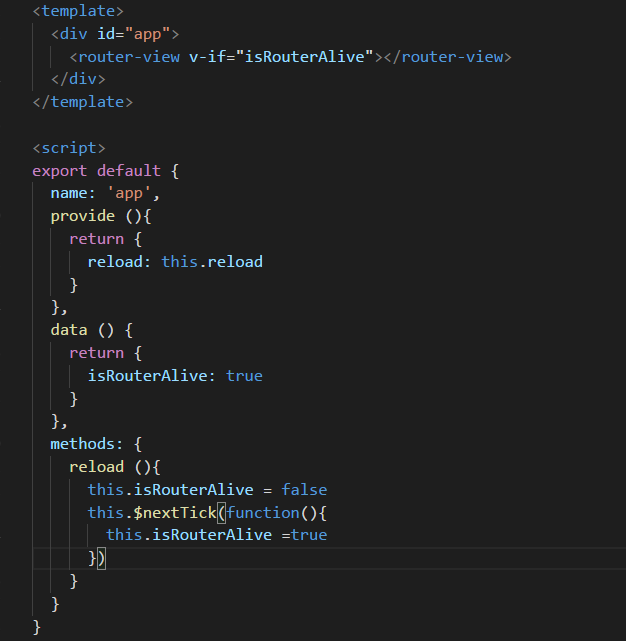
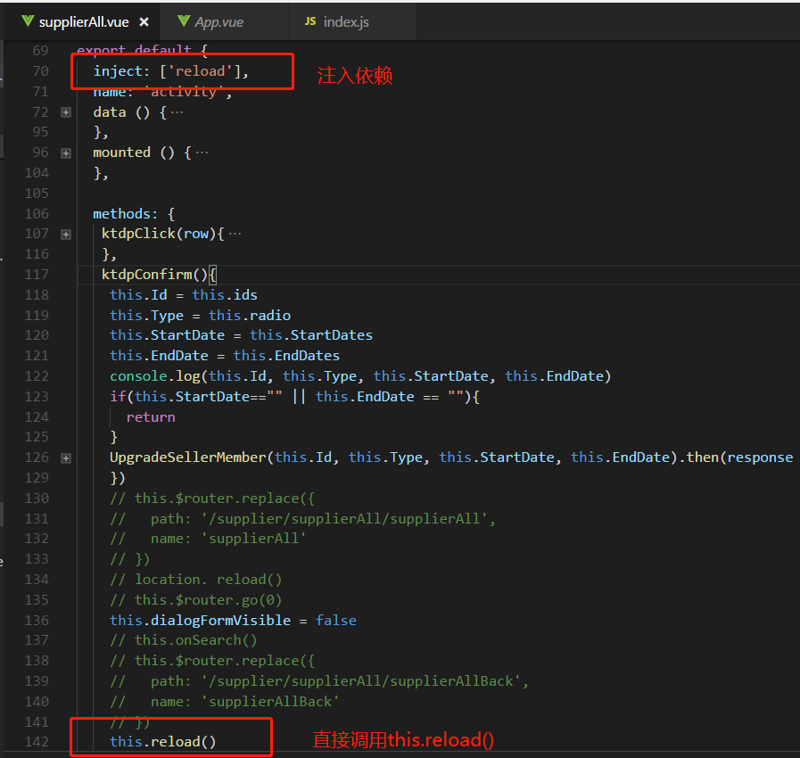

# vue项目刷新当前页面
### 那么表格的数据可以重新加载，Dialog 对话框设置的数据可以在确定后刷新出现在页面上

### 这时候我们最直接的思维就是想到下面这种：

### 但是，试过的会发现用vue-router重新路由到当前页面，页面是不进行刷新的，根本没有任何作用~所以这个方法out！

### 下面我这边整理几种可圈可点的三种方式，大家可以自行的选择：

### 1、最直接整个页面重新刷新：

### location. reload()

### this.$router.go(0)

### 这两种都可以刷新当前页面的，缺点就是相当于按ctrl+F5 强制刷新那种，整个页面重新加载，会出现一个瞬间的空白页面，体验不好

### 2、新建一个空白页面supplierAllBack.vue，点击确定的时候先跳转到这个空白页，然后再立马跳转回来

### 空白页supplierAllBack.vue里面的内容：

### 这个方式，相比第一种不会出现一瞬间的空白页，只是地址栏有个快速的切换的过程，可采用
### 3、provide / inject 组合 方式是我试过最实用的，下面用项目截图给大家说明下：首先，要修改下你的app.vue

### 通过声明reload方法，控制router-view的显示或隐藏，从而控制页面的再次加载，这边定义了

### isRouterAlive //true or false 来控制

### 然后在需要当前页面刷新的页面中注入App.vue组件提供（provide）的 reload 依赖，然后直接用this.reload来调用就行

