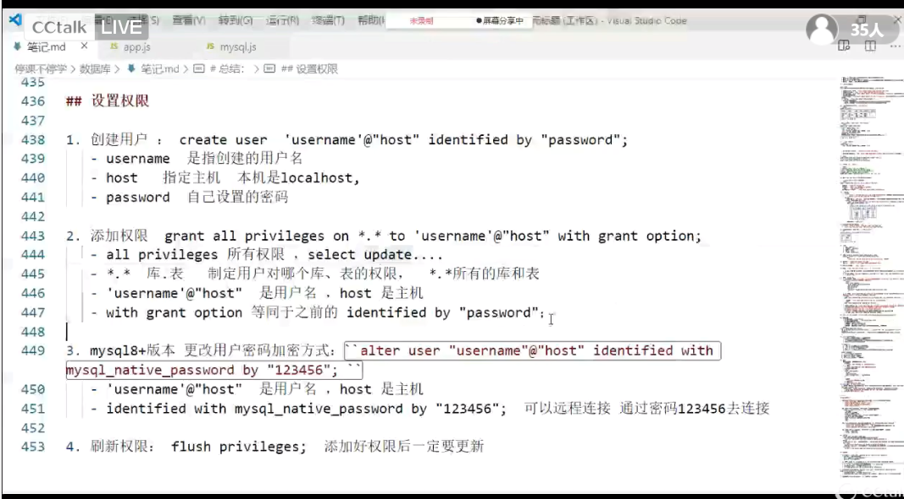
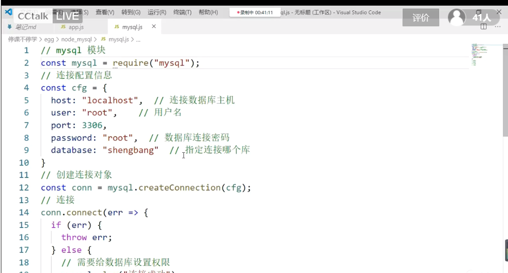

# mysql链接

### 设置权限

# 作业
1. 修改西红柿的价格为4
    update Products set Pprice = 4 where Pprice = 2;
2. 查询康师傅公司的产品信息
    select * from Products where pcompeny = "康师傅公司";
3. 查询商品名称，商品价格，生产日期，过期日期，生产厂商
    select pr.Pname as "商品名称",pr.Pprice as "商品价格",pr.ptime1 as "生产日期",pr.ptime2 as "过期日期",pr.pcompeny as "生产厂商" from Products as pr;
4. 查询价格在10 到 20 之间的商品信息
    select * from Products where Pprice > 10 and Pprice < 20;
5. 修改好丽友的生产公司为鼎新公司，价格为 10 元
    update Products set pcompeny = "鼎鑫公司",Pprice = 10 where Pname = "好丽友";
6. 查询销售表信息按照销售量降序排序
    select * from Orders order by Ocount desc;
7. 查询商品表的商品总个数   -count(*)
    select count(*) as "商品数量" from products;
8. 查询销售表中的销售总量
    select sum(Ocount) as "销售总量" from Orders;
9. 查询 商品编号，最大销售量（每件商品的最大销量）
    select PID as "商品编号",max(Ocount) as "最大销量" from Orders group by PID;
10. 查询 每件商品的销售总量只显示销售总量>30的信息 并对销售总量降序排序
    select PID,sum(Ocount) as "销售总量" from Orders group by Pid having sum(ocount) > 30 order by sum(ocount) desc;
11. 查询商品名称，单价，销售量，销售时间
    select pr.Pname as "商品名称",pr.Pprice as "单价",or.Ocount as "销量",or.otime as "销售时间" from Products as pr left join Orders as or on pr.PID = or.PID;（报错）
    select p.Pname as "商品名称",p.Pprice as "单价",o.Ocount as "销量",o.otime as "销售时间" from Products as p left join Orders as o on p.PID = o.PID;（对的）
12. 查询商品名称，单价，销量， 销售总价
    select p.Pname as "商品名称",p.Pprice as "单价", sum(o.Ocount)as "销量",p.Pprice*sum(o.Ocount) as "销售总价" from Products as p  join Orders as o on p.PID = o.PID group by p.PID;
13. 查询商品名称，单价，商品类别名称，销量，销售时间
    select p.Pname as "商品名称",p.Pprice as "单价",c.CName,o.Ocount,o.Otime from Products as p left join categroy as c on p.CID = c.CID left join Orders as o on p.PID = o.PID;
 
